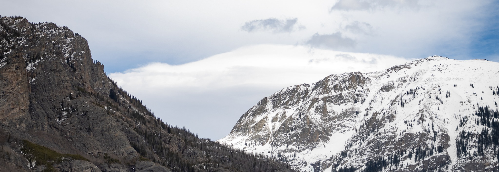

## A little about me:
Hello! Chances are that since you're here, you'd like to learn a little more about me! My name is Robert, I'm originally from Round Lake Beach, Illinois, but now I live in beautiful Grand Lake, Colorado! Currently for work, I'm a ski / bike patroller 
providing basic EMS to anyone who may need it. I've always had an interest in Software Development, as well 
as coding in general. 

My interest for coding first started back in 2008, when I discovered a game called Roblox. Essentially, Roblox 
is somewhat of a game engine, (more so now than it was back then), that primarily had you develop with Lua. 
Since then, I've spent a lot of time toying around with other languages like C#, Python, C++, C, and HTML. Now, I've finally decided it's time for me to commit to the bit and begin my journey down this career path.

## Stats:

## My goals:
Currently, I'm a student going through the Part Time Accelerated 3 Full Stack course provided by Coding Dojo! I'm hoping with the time I spend in the course, I'll be able to achieve these goals. 
- Become proficient in at LEAST three different full stacks of software development. 
- Build my confidence in the person I am and the work I offer. 
- Use that newfound confidence to begin the application process. 
- Spend my time working on one of my biggest passion projects: Build an open-source framework for web-based banking applications.
- Hire on and begin my career as a full stack software developer. 
- Find new ways every day to continue my learning and hopefully spread the knowledge I gain along the way. 

## Contact me:
For professional queries and or collaboration discussion, email me at: 
robert@teets.dev
